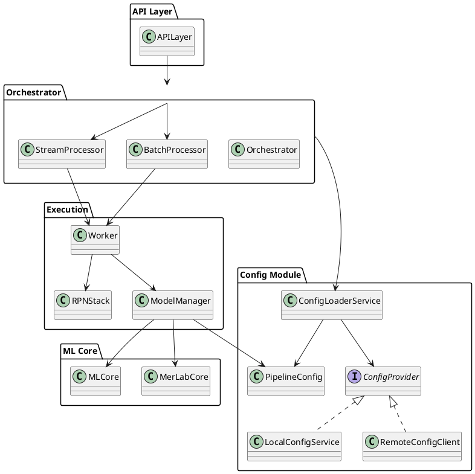

# StackFlowServer

StackFlowServer is a modular, extensible backend engine for processing, analyzing, and orchestrating data pipelines, machine learning, and signal processing tasks.  
It is designed for **medium-sized data applications** such as medical practices, engineering analytics, and business intelligence — not Big Data, but robust, real-world processing.

---

## Features

- **RPN Stack Core:** Perform data and signal operations with an RPN (Reverse Polish Notation) stack paradigm, supporting easy chaining and pipeline building.
- **Batch and Streaming Processing:** Efficiently process data both in batch mode (historical, scanned data) and real-time streaming (e.g., financial indicators, sensor signals).
- **Scenario Management:** Save, load, and reproduce entire processing pipelines and their results for reproducibility and regression testing.
- **Pluggable Architecture:** Easily extend with plugins for new algorithms, data sources, ML models, or visualization.
- **Monitoring and Logging:** Advanced monitoring of resources, jobs, model training, and key metrics with alerting capabilities.
- **Multi-DB Support:** Works with MariaDB, PostgreSQL, and NoSQL databases out-of-the-box.
- **REST API & Scripting:** Full REST endpoints for orchestration and a scripting layer (Merlynx) for custom pipeline creation.
- **User Roles & Security:** Basic user roles (Admin, Analyst, Viewer) for access control.

---

## Architecture

Below is a simplified ASCII architecture diagram (see UML for full details):

```plaintext
       +----------------+
       |     User       |
       +----------------+
                |
      (authenticated by)
                v
       +----------------+
       |   APILayer     |
       +----------------+
                |
         (delegates to)
                v
       +----------------+
       | Orchestrator   |
       +----------------+
   /   |     |     |    |    |    \
  v    v     v     v    v     v    v
+----------+ +----------+ +-----------+ +--------------+ +-------------+ +-------------+ +-----------+
|BatchProc | |StreamProc| |ScenarioMgr| |PluginManager | | Monitor | | MLCore | | MerLabCore|
+----------+ +----------+ +-----------+ +--------------+ +-------------+ +-------------+ +-----------+
| | | | |
v v v v v
+--------+ +-------+ +-----------+ +-------------+ +------------+
| Worker | |Buffer | | Scenario | | Archiving | | DBAdapter |
+--------+ +-------+ +-----------+ +-------------+ +------------+
| | (managed by) (used for (used for
v v versions, logs) DB ops)
+--------+ +--------+
|RPNStack| |RPNStack|
+--------+ +--------+
| \ / |
v v v v
+---------+ +--------+
|StackElem| |Operation|
+---------+ +--------+

(Relationships: e.g., APILayer --> Orchestrator, Orchestrator --> BatchProc, etc.)
```

---


---
# 📘 StackFlowServer – Dynamic Pipeline Configuration Module

## Overview

This section describes the **new dynamic configuration module** we are integrating into the **StackFlowServer** project.  
The module allows **loading versioned pipeline configurations and associated ML models when starting a pipeline**, without requiring hot reloading or continuous polling during execution.  

This approach fits the **unique design of StackFlowServer**, which combines:

- A **dynamic RPN (Reverse Polish Notation) stack** for pipeline definition.
- A **custom processing language**.
- Flexible configuration snapshots at pipeline start.

Unlike many systems where the pipeline is static ("fixed boxes"), here the pipeline can be defined dynamically through StackFlowServer's stack logic.  

---

## ✨ Objectives

- Enable **versioned configurations** for pipelines.
- Allow **model selection and loading** at pipeline startup.
- Avoid unnecessary polling of configuration changes during long-running computations.
- Prepare the architecture for future microservice-based configuration storage if needed.

---

## 🛠️ New Components

Below is a list of the new classes and their roles:

| Class                   | Description                                                           |
|-------------------------|-----------------------------------------------------------------------|
| `ConfigProvider`        | Interface for fetching pipeline configuration from any source.       |
| `LocalConfigService`    | Implementation that loads configuration from the local database.     |
| `RemoteConfigClient`    | (Optional) Future implementation to load config via REST API.        |
| `ConfigLoaderService`   | Central service to retrieve configuration when starting a pipeline.  |
| `PipelineConfig`        | DTO containing configuration details (version, model path, parameters). |
| `ModelManager`          | Loads the ML model specified in the configuration.                  |
| `Orchestrator`          | Starts and stops pipelines, initializes the configuration and models.|

---

## 🎯 Usage Flow

1. **User triggers pipeline start.**
2. `Orchestrator` calls `ConfigLoaderService.loadConfig(pipelineName)`.
3. The configuration snapshot is returned (`PipelineConfig`).
4. `ModelManager` loads the model specified in the configuration.
5. The `RPNStack` is initialized with the parameters.
6. The pipeline starts processing with this configuration.
7. To change configuration, the user stops the pipeline, updates settings, and starts again.

This design ensures **deterministic execution** without unexpected configuration changes while the pipeline is active.

---

## 🧩 Architectural Diagram


---


## 🌟 Key Characteristics
✅ No continuous polling – configuration is loaded only when a pipeline starts.
✅ Safe and predictable execution – model and parameters are fixed during processing.
✅ Future-proof – architecture is ready to switch to microservice-based configuration if needed.
✅ Dynamic pipeline definition – using RPN stack instead of static pipeline graphs.

## 🚀 Next Steps
1. Implement the LocalConfigService and ConfigLoaderService.
2. Integrate ModelManager with actual model loading logic.
3. Update Orchestrator and Worker to consume configuration.
4. Add test cases for loading and starting pipelines.

## 🙌 Contribution & Contact
If you have questions or ideas to improve the architecture, feel free to contribute or reach out.


---
## Example Use Cases

### 1. **Medical Data Batch Analysis**
> Process a clinic’s last quarter of ECG records, automatically identify anomalies, and generate warnings or reports for physicians.

### 2. **Business Intelligence & Dashboards**
> Analyze transaction or sensor data from a medium-sized company, visualize trends, and produce interactive dashboards or alerts.

### 3. **Real-Time Streaming Analytics**
> Ingest real-time dollar/euro exchange rate data, apply signal processing and ML models, and trigger alerts or actions if indicators are abnormal.

---

## Core Modules & Responsibilities

| Module         | Purpose                                                               |
|----------------|-----------------------------------------------------------------------|
| APILayer       | Exposes REST endpoints and scripting for external clients             |
| Orchestrator   | Central coordinator for jobs, events, batch/stream scheduling         |
| BatchProcessor | Divides work into chunks, manages Workers for batch processing        |
| StreamProcessor| Handles incoming events, manages windowed streaming analytics         |
| RPNStack       | Core stack-based signal/data processor                                |
| ScenarioManager| Manages, saves, and runs pipeline scenarios                           |
| Monitor        | Logs, metrics, alerts, resource tracking                              |
| PluginManager  | Loads/unloads plugins and extensions                                  |
| MLCore         | Machine Learning (train, predict, model lifecycle)                    |
| MerLabCore     | Core signal/data processing engine                                    |
| Archiving      | Versioning and rollback of scenarios/results                          |
| DBAdapter      | Database access abstraction (MariaDB, PostgreSQL, etc.)               |
| User           | User entity with roles (Admin, Analyst, Viewer)                       |

---

## Scenarios and Reproducibility

- Each scenario captures the full state (stack, parameters, results) for a complete pipeline run.
- Scenarios can be run in batch for regression testing or comparison.
- Supports “golden scenarios” to ensure results remain consistent after code or model changes.

---

## Plugin System

- Integrate third-party or custom plugins for:
    - New ML algorithms (DL4J, Python bridges, etc.)
    - External data sources (HL7 for medical, CSV, REST, etc.)
    - Visualization tools

---

## Roadmap

- [ ] GUI for pipeline building (visual RPN stack)
- [ ] Extended real-time streaming support (Kafka, RabbitMQ)
- [ ] User authentication and OAuth integration
- [ ] Auto-scaling and distributed orchestration
- [ ] Built-in dashboard and reporting modules
- [ ] Enhanced plugin marketplace

---

## Contributing

Contributions and ideas are welcome!  
See [CONTRIBUTING.md](CONTRIBUTING.md) for details (coming soon).

---

## License

This project is licensed under the Apache License, Version 2.0.  
See the [LICENSE](LICENSE) file for details.

---

## Contact

Created by [Your Name or GitHub username].  
Questions, feature requests, or ideas? Open an [issue](https://github.com/YOUR-USERNAME/StackFlowServer/issues) or contact me!

---

## UML Diagrams

> See the `/docs/uml` folder for full PlantUML code and graphical diagrams.

---


